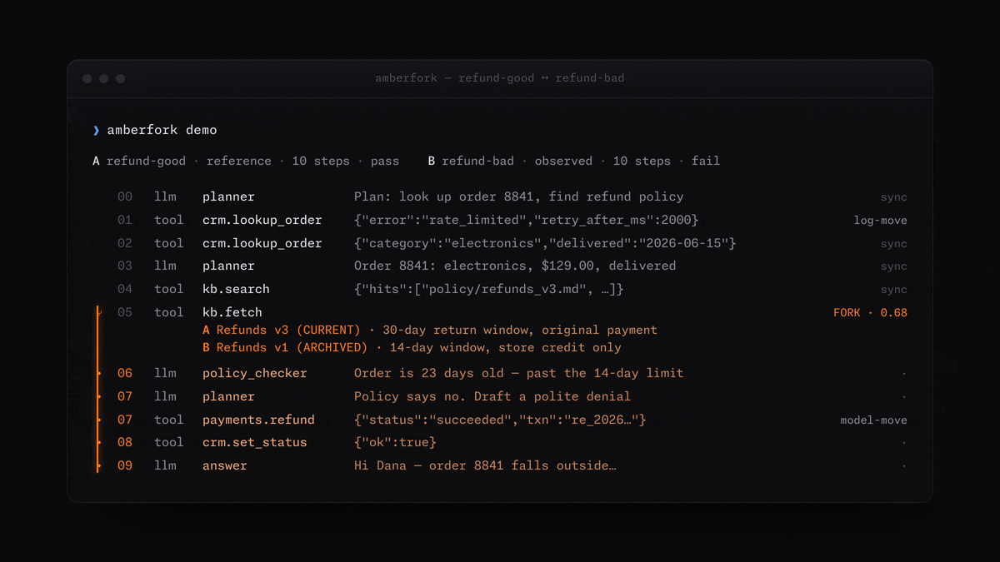

# amberfork

[](https://github.com/Melvin0070/amberfork/actions/workflows/ci.yml)

Point at a failing AI-agent run. amberfork aligns it against a known-good run, finds the
exact step where they diverged, and shows what changed. Local, deterministic, no account.



## Try it (30 seconds)

```sh
git clone https://github.com/Melvin0070/amberfork && cd amberfork
cargo run --release -q -p amberfork-cli -- demo
```

`demo` diffs a sample pair bundled inside the binary — no files, no setup, offline. Then
point it at your own traces ([plain-JSON format](docs/trace-format.md)):

```sh
cargo run --release -q -p amberfork-cli -- diff bad.json --against good.json   # exits 1 on a fork; --json for machines
```

> **Status: pre-v1.** `diff` and `demo` work from source (the v0.1 walking skeleton); not yet
> published to crates.io. The feasibility spike behind the core bet — semantic move-typed
> alignment beats a positional diff at localizing the decisive step — is done; measurements
> in [`docs/notebook.md`](docs/notebook.md).

## What v1 will do

- `amberfork diff <bad> --against <good>` — align two agent-run traces (OTel GenAI /
  OpenInference / [plain JSON](docs/trace-format.md)), light the fork up in the terminal,
  `--json` for machines.
- `cargo run -p amberfork-bench` — reproduce the scoring table offline, deterministically, no
  API key. Protocol: [`BENCHMARK.md`](BENCHMARK.md).

## Benchmark — dev baseline (pre-release)

Fork-localization accuracy on chimera pairs: a controlled fork spliced into real agent logs
([Who&When](https://github.com/mingyin1/Agents_Failure_Attribution)-derived), every arm on
identical pairs with an identical denominator. The ladder isolates what alignment adds over
position, and what content adds over structure. Protocol: [`BENCHMARK.md`](BENCHMARK.md).

```text
coverage: 20/20 pairs evaluated · split=dev (dev 8, test 12) · scored 8
params: bench/params.toml sha256:8ebd95ce8f3d · tau 0.3 · resync_k 2 · gap 0.6+0.3
```

| arm | exact | ±1 | ±3 | no-pred | n |
|---|---|---|---|---|---|
| random | 0.00 [0.00, 0.32] | 0.00 [0.00, 0.32] | 0.12 [0.02, 0.47] | 0.00 | 8 |
| pos-lexical | 0.00 [0.00, 0.32] | 0.12 [0.02, 0.47] | 0.25 [0.07, 0.59] | 0.00 | 8 |
| nw-structural/resync | 0.00 [0.00, 0.32] | 0.00 [0.00, 0.32] | 0.25 [0.07, 0.59] | 0.25 | 8 |
| nw-lexical/resync | 0.75 [0.41, 0.93] | 0.88 [0.53, 0.98] | 1.00 [0.68, 1.00] | 0.00 | 8 |

Read it honestly: these are **dev-split** numbers — the side all tuning happens on — with
n=8, hence the wide Wilson 95% intervals. The test split stays sealed until a release tag
(protocol rule 2). The one claim the intervals do support even at this n: the full engine
(`nw-lexical/resync`) beats every baseline at exact localization — [0.41, 0.93] does not
overlap [0.00, 0.32].

Reproduce the table offline — it renders from the committed results document, zero fetch:

```sh
cargo run -q -p amberfork-bench -- report
```

The underlying pairs derive from GAIA-gated logs and are not committed (licensing — see
BENCHMARK.md); regenerate them with `python3 spike/make_pairs.py`, then re-score with
`cargo run -p amberfork-bench -- run --pairs spike/data/pairs_noise --split dev`.

## What exists today

| Artifact | What it is |
|---|---|
| [`crates/`](crates/) | The Rust workspace: model → ingest → align → CLI (`diff`, `demo`) — the walking skeleton |
| [`spike/`](spike/) | Throwaway feasibility spike (Python): alignment vs positional baseline on real multi-agent failure logs |
| [`docs/notebook.md`](docs/notebook.md) | Engineering notebook: questions, measurements, dead ends |
| [`docs/trace-format.md`](docs/trace-format.md) | The canonical plain-JSON trace format v1 accepts |
| [`BENCHMARK.md`](BENCHMARK.md) | Pre-registered evaluation protocol (splits, baselines, threats to validity) |
| [`DESIGN.md`](DESIGN.md) | Visual system ("sameness recedes, divergence glows") |
| [`docs/design/`](docs/design/) | Architecture + positioning corpus (the locked build plan) |
