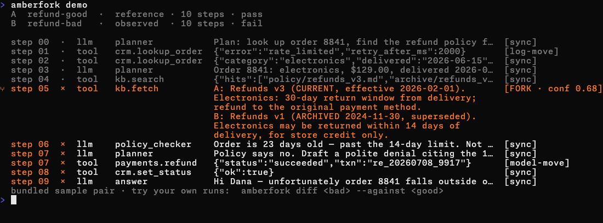

# amberfork

[](https://github.com/Melvin0070/amberfork/actions/workflows/ci.yml)

Point at a failing AI-agent run. amberfork aligns it against a known-good run, finds the
exact step where they diverged, and shows what changed. Local, deterministic, no account.



## Try it (30 seconds)

```sh
git clone https://github.com/Melvin0070/amberfork && cd amberfork
cargo run --release -q -p amberfork-cli -- demo
```

`demo` diffs a sample pair bundled inside the binary — no files, no setup, offline. Then
point it at your own traces ([plain-JSON format](docs/trace-format.md)):

```sh
cargo run --release -q -p amberfork-cli -- diff bad.json --against good.json   # exits 1 on a fork; --json for machines
```

> **Status: pre-v1.** `diff` and `demo` work from source (the v0.1 walking skeleton); not yet
> published to crates.io. The feasibility spike behind the core bet — semantic move-typed
> alignment beats a positional diff at localizing the decisive step — is done; measurements
> in [`docs/notebook.md`](docs/notebook.md).

## What v1 will do

- `amberfork diff <bad> --against <good>` — align two agent-run traces (OTel GenAI /
  OpenInference / [plain JSON](docs/trace-format.md)), light the fork up in the terminal,
  `--json` for machines.
- `cargo run -p amberfork-bench` — reproduce the scoring table offline, deterministically, no
  API key. Protocol: [`BENCHMARK.md`](BENCHMARK.md).

## What exists today

| Artifact | What it is |
|---|---|
| [`crates/`](crates/) | The Rust workspace: model → ingest → align → CLI (`diff`, `demo`) — the walking skeleton |
| [`spike/`](spike/) | Throwaway feasibility spike (Python): alignment vs positional baseline on real multi-agent failure logs |
| [`docs/notebook.md`](docs/notebook.md) | Engineering notebook: questions, measurements, dead ends |
| [`docs/trace-format.md`](docs/trace-format.md) | The canonical plain-JSON trace format v1 accepts |
| [`BENCHMARK.md`](BENCHMARK.md) | Pre-registered evaluation protocol (splits, baselines, threats to validity) |
| [`DESIGN.md`](DESIGN.md) | Visual system ("sameness recedes, divergence glows") |
| [`docs/design/`](docs/design/) | Architecture + positioning corpus (the locked build plan) |
