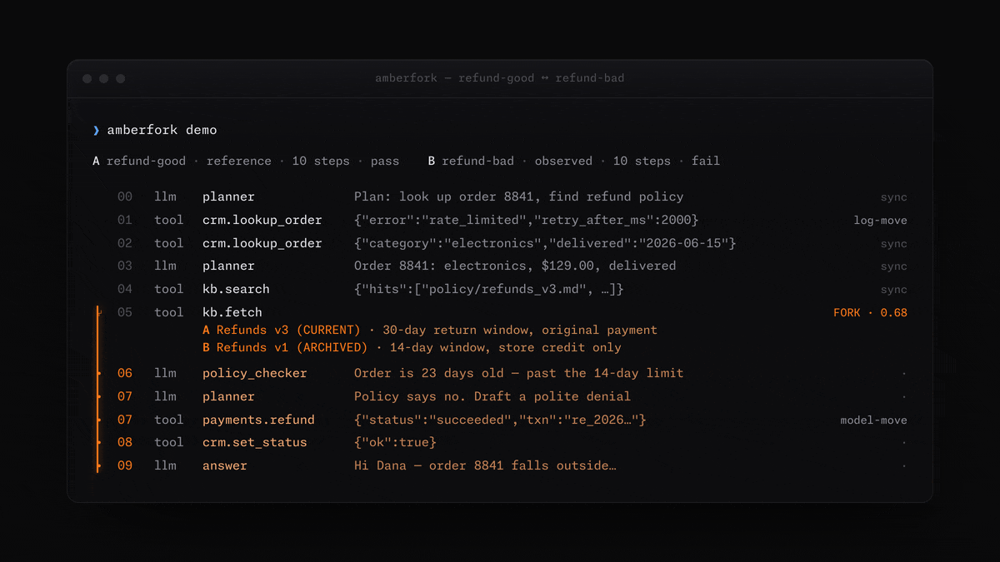

# amberfork

[](https://github.com/Melvin0070/amberfork/actions/workflows/ci.yml)
[](https://crates.io/crates/amberfork)
[](https://docs.rs/amberfork)
[](LICENSE)

Point at a failing AI-agent run. amberfork aligns it against a known-good run, finds the
exact step where they diverged, and shows what changed — then, on a run you captured under
`record`, confirms the cause by replaying it with that step patched. All local, offline, no
account.


## Try it (30 seconds)

```sh
cargo install amberfork        # or a prebuilt binary from the releases page, or build from source
amberfork serve --demo         # the view above — the bundled sample fork in your browser
amberfork demo                 # or the same fork rendered in your terminal
```

`--demo` is a sample pair bundled inside the binary — no files, no setup, offline. `serve` opens
it as a local `127.0.0.1` web page (nothing leaves your machine); `demo` prints it to the
terminal. Then point either at your own traces ([plain-JSON format](docs/trace-format.md); worked
example in [the run-it-on-your-own-agent guide](docs/run-on-your-own-agent.md)):

```sh
amberfork diff  bad.json --against good.json   # exits 1 on a fork; --json for machines
amberfork serve bad.json --against good.json   # or read the fork in the browser
```

The same fork, in your terminal:



> **Status: pre-v1.** The working surface: `diff` (terminal, `--json`, `--html` for a
> self-contained static export, and an optional `--judge local` narration under a local Ollama
> server), `serve` (the browser view above), `demo`, and — for runs captured under `record` —
> `diff --verify`, which replays the recorded run with the fork step patched to confirm the
> cause. The feasibility spike behind the core bet — semantic move-typed alignment beats a
> positional diff at localizing the decisive step — is done; measurements in
> [`docs/notebook.md`](docs/notebook.md).

## What v1 will do

- `amberfork diff <bad> --against <good>` — align two agent-run traces
  ([plain JSON](docs/trace-format.md), plus OpenInference and native OTel `gen_ai.*` adapters —
  see [the format mappings](docs/trace-format.md)), light the fork up in the terminal, `--json`
  for machines.
- `amberfork diff <bad> --against <good> --verify` — on a run captured under `amberfork record`,
  replay it with the fork step patched and report whether the run recovers, to *confirm* the
  cause rather than only locate it.
- `cargo run -p amberfork-bench` — reproduce the scoring table offline, deterministically, no
  API key. Protocol: [`BENCHMARK.md`](BENCHMARK.md).

## Benchmark — sealed test split (v0.2.0)

Fork-localization on chimera pairs: a controlled fork spliced into real agent logs
([Who&When](https://github.com/ag2ai/Agents_Failure_Attribution)-derived), every arm on
identical pairs with an identical denominator. Protocol: [`BENCHMARK.md`](BENCHMARK.md).

**The headline** (sealed test split, three seeds, n=35 — revealed once, at the v0.2.0 tag,
under params frozen before any test pair was scored): the full engine localizes the fork
**within 3 steps 91% of the time** — 0.91 [0.78, 0.97] vs the best baseline's 0.49
[0.33, 0.64], non-overlapping intervals — and takes **0.49 exact** where the baselines'
best is 0.03 (notebook 017).

| arm (test, n=35 across 3 seeds) | exact | ±1 | ±3 |
|---|---|---|---|
| random | 0.00 | 0.09 | 0.29 |
| pos-lexical | 0.00 | 0.20 | 0.49 |
| nw-structural/resync | 0.03 | 0.20 | 0.20 |
| **nw-lexical/resync** (full engine) | **0.49** | **0.71** | **0.91** |

The dev side these params were tuned on agrees: exact 0.56 · ±1 0.72 · ±3 1.00 (n=25) — no
overfitting cliff. **Exact-step** localization is *seed-sensitive* on unseen pairs too (0.75 /
0.23 / 0.50 on seeds 42 / 43 / 44), the same shape dev showed — which is why the ±3 window,
not exact, is the claim (notebooks 014, 017). The engine's fork confidence is calibrated on
unseen data: exact-hit rate climbs monotonically from 0.08 in the lowest-confidence bin to
1.00 in the two highest.

Every number above renders from a committed document. The headline table IS
`bench/results/chimera_noise_multiseed_test.json` — an exact pool (hits and n summed,
Wilson intervals recomputed) of the **three sealed per-seed test documents**
(`bench/results/chimera_noise_seed*_test.json`), each of which it names by sha256; a test
rebuilds the aggregate from its committed sources byte-for-byte. **Seed 42's dev split** is
the default `report` below (the CI gate additionally pins seeds 43/44 —
`bench/fixtures/chimera_noise_seed*_dev/`):

```text
params: bench/params.toml sha256:8ebd95ce8f3d · tau 0.3 · resync_k 2 · gap 0.6+0.3
| nw-lexical/resync | 0.75 [0.41, 0.93] exact | 0.88 ±1 | 1.00 ±3 | n=8 |  (dev, seed 42)
```

Read it honestly: these are **injected** forks — a controlled divergence spliced into real logs — so
sustained divergence at the gold step is true *by construction*, which structurally favors the
content-aware alignment arms. What the headline measures is the aligner's tolerance to benign noise
around a known fork, not attribution on a *natural* failure (for that, see the Mode A′ null below).
Wilson 95% intervals are wide at these n, and the test split is scored exactly once per release tag
(protocol rule 2) — the next reveal comes with the next tag. (The v0.4.0 and v0.5.0 reveals reproduced
these numbers identically on every arm and metric — `bench/results/*_test_v0.4.0.json` /
`*_test_v0.5.0.json`, notebooks 021 and 037.) The claim the numbers support is the *shape* —
content-aware alignment localizes within a few steps where position and structure do not.

Reproduce the tables offline — they render from the committed results documents, zero fetch:

```sh
cargo run -q -p amberfork-bench -- report --results bench/results/chimera_noise_multiseed_test.json   # the headline (test, n=35)
cargo run -q -p amberfork-bench -- report    # seed-42 dev (the default)
cargo run -q -p amberfork-bench -- report --results bench/results/chimera_noise_seed42_test.json      # one seed's test slice
```

The dev-split pairs are committed (GAIA-sanitized — see `bench/fixtures/`); the CI gate scores
them on every `amberfork-align` change. Regenerate the full sets from raw upstream data with the
recipe in [`bench/fixtures/chimera_noise_seed42_dev/README.md`](bench/fixtures/chimera_noise_seed42_dev/README.md).

### Mode A′ — real cross-system pairs (directional, n=4)

The second protocol scores *natural* failures: a failing Who&When run against a passing
reference from a **different agent system** (a ServiceNow TapeAgents tape) on the same GAIA
task. The whole pipeline is in-tree, pinned, and reproducible:

```sh
cargo run -q -p amberfork-bench -- fetch    # pinned upstream data → bench/data/ (never committed)
cargo run -q -p amberfork-bench -- build-pairs --tapes bench/data/tapes --logs bench/data/whowhen --out bench/data/pairs_real
cargo run -q -p amberfork-bench -- run --pairs bench/data/pairs_real --split all
```

Public data yields exactly **4 pairs** (only 4 published tapes pass their task), and the honest
result is a **null**: the engine reaches 0.50 ±3 while *random guessing reaches 0.75*, because
these runs are 7–10 steps long (a ±3 window covers most of the run) and a reference from a
different system legitimately diverges from step 0, making the annotated "decisive step" a weak
gold target. Both limits were pre-registered in [`BENCHMARK.md`](BENCHMARK.md)'s
threats-to-validity before the measurement (notebook 016). So Mode A′ ships as a disclosed
limit, not a headline — the table (cross-system banner included) re-renders offline:

```sh
cargo run -q -p amberfork-bench -- report --results bench/results/mode_a_prime_realpairs_all.json
```

### TRAIL↔HAL natural pairs (n=69) — a null, and the LLM-judge baseline that measured it

The third protocol is the strongest attempt at a natural-fork number: a real **TRAIL** failing
trace against a real **HAL** passing reference on the same GAIA task, same Open Deep Research
scaffolding, differing backing model, with gold taken from TRAIL's *human-annotated* error span.
117 traces yield **69 pairs** (23 dev / 46 test).

The engine scores **0.00 exact** on it, against random's 0.14 — worse than guessing:

```sh
cargo run -q -p amberfork-bench -- report --results bench/results/trail_hal_natural_all.json
```

Rather than leave that as an unexplained null, the missing baseline was built and
[pre-registered first](docs/notebook.md) (notebook 069, written before any judge code existed):
**does just asking a frontier model beat the aligner?** Five arms on the 23 dev pairs, zero
exclusions, every answer cached so the table replays offline:

| arm | model | exact | ±3 | n |
|---|---|---|---|---|
| `random` | — | 0.174 | 0.565 | 23 |
| `nw-lexical/resync` (the engine) | — | **0.000** | 0.348 | 23 |
| `judge-single` | gpt-5.6-sol | **0.261** | 0.522 | 23 |
| `judge-paired` | gemini-3.6-flash | 0.217 | 0.478 | 23 |
| `judge-paired` | gpt-5.6-sol | 0.174 | 0.478 | 23 |
| `judge-paired` | qwen3:8b (local) | 0.087 | 0.565 | 23 |
| `judge-stepwise` | gpt-5.6-luna | 0.087 | 0.217 | 23 |

**Three of five judge arms beat the engine with paired-bootstrap intervals excluding zero.** The
result is published as measured (`bench/results/judge_*.json`, notebook 071).

Two findings matter more than the ranking. First, **no arm meaningfully clears random** — at ±3
random beats every arm including all four frontier judges, so this corpus barely discriminates
*any* method. Second, inspecting per-pair predictions rather than rates: **all three aligner arms
predict step 0 on all 23 pairs.** The pairs share *zero* step names — TRAIL logs
`CodeAgent.run`/`web_search`, HAL logs `openai.chat.completions.create`/`tool_result` — so there is
no common prefix to fork from and the fork rule degenerates to a constant. The 0.348 at ±3 is
entirely the 8 of 23 pairs whose gold happens to sit at step ≤ 3.

That diagnosis, and the repair it implies, are [pre-registered in notebook 070](docs/notebook.md)
with the decision rule fixed in advance — including the branch where the corpus is retired as a
documented negative result. **The chimera numbers above are untouched** (protocol rule 10: a
baseline never disturbs the product's published table).

## What exists today

| Artifact | What it is |
|---|---|
| [`crates/`](crates/) | The Rust workspace (11 crates): model → ingest → align → layout → server → record → replay → attrib → judge → CLI (`diff` / `demo` / `serve`, and `--verify` on recorded runs), plus the `amberfork-bench` harness and the embedded Leptos web UI |
| [`spike/`](spike/) | Throwaway feasibility spike (Python): alignment vs positional baseline on real multi-agent failure logs |
| [`docs/notebook.md`](docs/notebook.md) | Engineering notebook: questions, measurements, dead ends |
| [`docs/trace-format.md`](docs/trace-format.md) | The canonical plain-JSON trace format v1 accepts |
| [`BENCHMARK.md`](BENCHMARK.md) | Pre-registered evaluation protocol (splits, baselines, threats to validity) |
| [`DESIGN.md`](DESIGN.md) | Visual system ("sameness recedes, divergence glows") |
| [`docs/design/`](docs/design/) | Architecture + positioning corpus (the locked build plan) |

## Project status — parked at v0.9.1 (2026-08-13)

Everything above works and is reproducible today. The remaining roadmap is **specified but not
built**, and is paused deliberately rather than abandoned mid-thought — each item below is an open
issue with its decision already argued in the notebook, so it can be picked up cold.

**Done and standing:** 11 crates, the chimera sealed-test protocol (scored at three release tags,
identical every time), the Mode A′ null, the TRAIL↔HAL null, and the LLM-judge baseline with its
cassettes committed so every table replays offline with no API key.

**The next experiment is already registered.** Notebook 070 pre-registers the ingest repair the
judge run's diagnosis implies — tool-name reconstruction and provider-envelope unwrapping in
`hal.rs`, abstention when two runs share no common ground, and a granularity-based corpus
stratification — with its success test, its blast radius, and its failure branch all fixed *before*
implementation. Whoever runs it, including a future me, is bound by a decision rule they did not
write after seeing the number.

**Known defect, honestly:** on two runs that share no common prefix, amberfork reports "fork at
step 0" with high confidence (measured: 0.97) rather than admitting the runs are not comparable.
The abstention guard in 070 is the fix. It is the highest-value item on the list, because it
affects real use, not a benchmark row.

**Open issues** carry the rest: `#47`–`#57` for the v1.0 release work (perf ceiling, `--gate`, the
release matrix, the writeup) and `#58`–`#63` as decided post-v1 deferrals. `CONTRIBUTING.md`
describes the working agreement; `BENCHMARK.md` governs any number that gets published.

If you are evaluating this repo: the honest entry point is
[`docs/notebook.md`](docs/notebook.md) — 71 dated entries including the experiments that failed,
the two nulls above, and the baseline that beat us.
